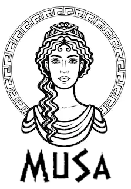

# MuSa
Welcome to MuSa, the experience manager for "Museo Sapienza". MuSa is a project developed during the IoT course in Sapienza, University of Rome. In a sentence, MuSa collects information about users, profiles them and provides custom journeys between the artworks in the museum. To better understand her power and what she can do for you please keep reading those pages.

We reached the last delivery of this project, and it has been an amazing adventure for us. As you will see we are somehow providing a fully working project, integrated and tested, with only one missing piece about machine learning custom tour generation. If you are interested in MuSa and you would like to talk with us, please contact us on our LinkedIn pages. 
If you would like to keep on going with MuSa on your own you are welcome, and we would be really happy to see that. You can add new features and add good machine learning strategies to generate ad hoc tours. We are also going to explain to you how to tune up an environment for developing and run the code of each piece of the project.  
Even if the IoT looks like the core of MuSa, connecting all the different part of the project, to get a complete experience we required knowledge in many different subjects of computer science and engineering. It has not been easy, to be honest, but we unlocked many different skills and we are very proud about that.

Do you want to try MuSa today? You can do that. Just pre-define a certain amount of tour and assign them to the users due to their preferences. Since we have many different pieces to take into account please refer to release notes for a full installation in your environment. 

Let's start this journey!

## About us
We are three students currently enrolled in the Master's Degree course "Engineering in Computer Science", 1st year.    
### Who we are
[Gianmarco Zizzo](https://www.linkedin.com/in/gianmarco-zizzo-9741861a3/)

[Silvia Del Piano](https://www.linkedin.com/in/silvia-del-piano-2482391a6)

[Stefano Foti](https://www.linkedin.com/in/stefano-foti/)

Design advisor: 
[Francesco Gregori](https://www.linkedin.com/in/francesco-gregori-7136ab1a3/)

## The project
MuSa collects and analyze information about visitors and their tours and propose custom journeys, to offer a new way to enjoy the art. At the very beginning, every user should fill a short survey to collect information about his personality. Then MuSa will ask him if he wants to enjoy a custom tour or just help with data collecting. Of course, the user may also choose to not use the system at all. When a user wants just to contribute with data collecting he will start traveling on his own inside the museum with his smartphone collecting data in a non-invasive way inside his pocket. When a user wants to enjoy the tour with MuSa, indeed, he will just start exploring the museum follow the custom suggestions MuSa will show him.

## Read more
If you want to discover more, give a look to the following documents:
- [Design document](docs/Design.md)
- [Architecture document](docs/Architecture.md)
- [Evaluation document](docs/Evaluation.md)  

You can find the first version of these documents in the folder [first-delivery](/first-delivery)

------------------------------------------------------------------------------------------------------------------------------------------------------
Unchanged documentation since the first delivery:
- [Design and Evaluation video](https://www.youtube.com/watch?v=7l4aW7eUjL8)
- [Architecture video](https://youtu.be/ARw2u26Rarg)
- [Presentation PDF](/docs/src/presentation/presentation.pdf)
- [Presentation PPTX](/docs/src/presentation/presentation.pptx)
------------------------------------------------------------------------------------------------------------------------------------------------------
- [2nd Delivery document](/2nd-Delivery.md)
- [Technical demo video](https://youtu.be/QBQiZBxFIYg)
- [Evaluation done video](https://youtu.be/_k9-HsL0Ox8)
- [Future plans video](https://www.youtube.com/watch?v=rPU-n5VDRK4&feature=youtu.be)
- [Second delivery presentation PDF](/docs/src/presentation/2ndPresentation.pdf)
- [Second delivery presentation PDX](/docs/src/presentation/2ndPresentation.pptx)
- [Second questionnaire](https://docs.google.com/forms/d/e/1FAIpQLScuXQogq65TNMCWS0vha5jCFXTIvuk0Vr5boziSh9H5GiGm-w/viewform?usp=sf_link)

