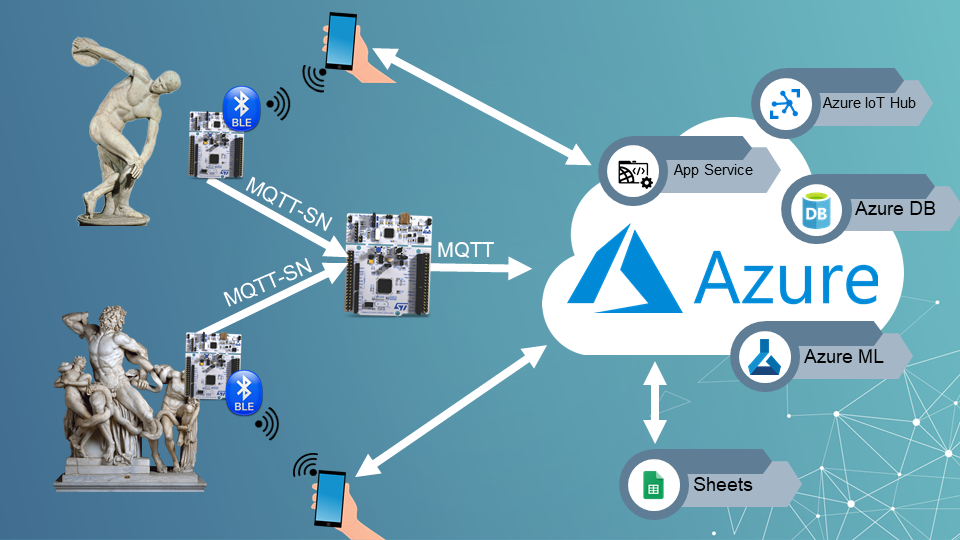
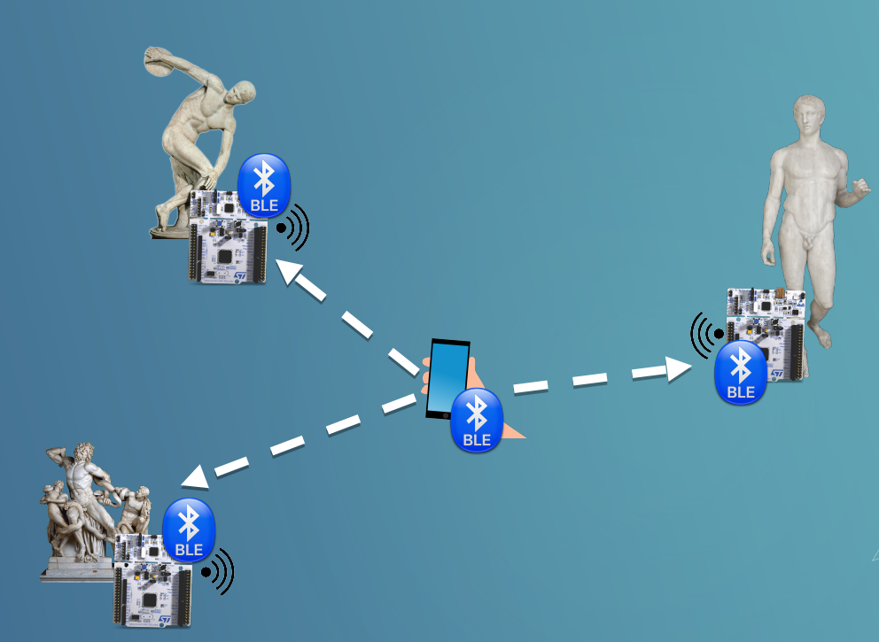
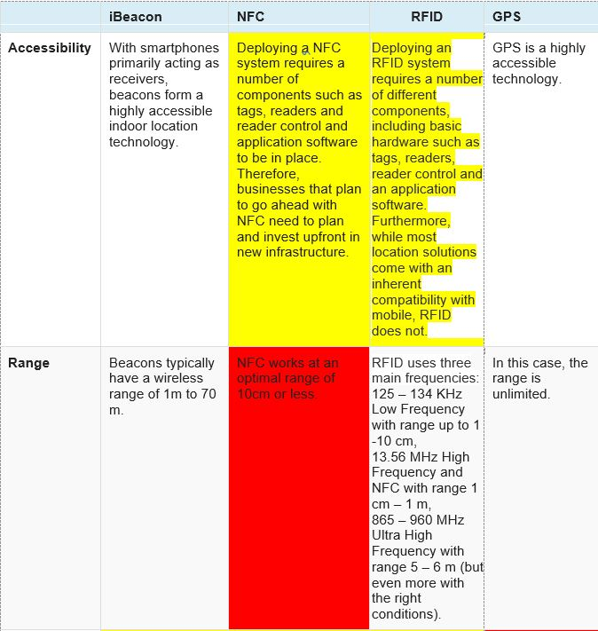
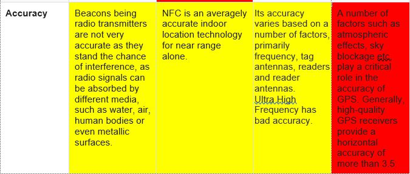
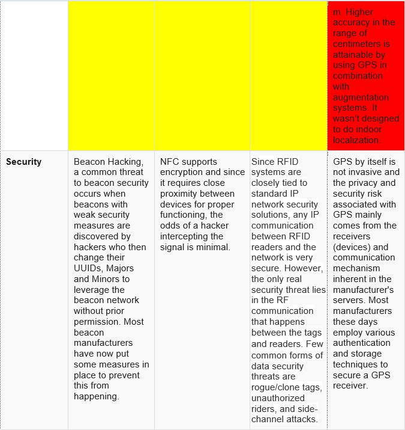
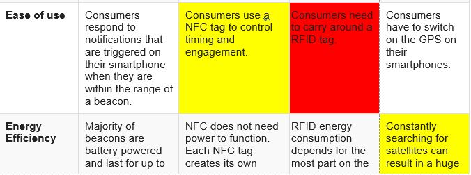
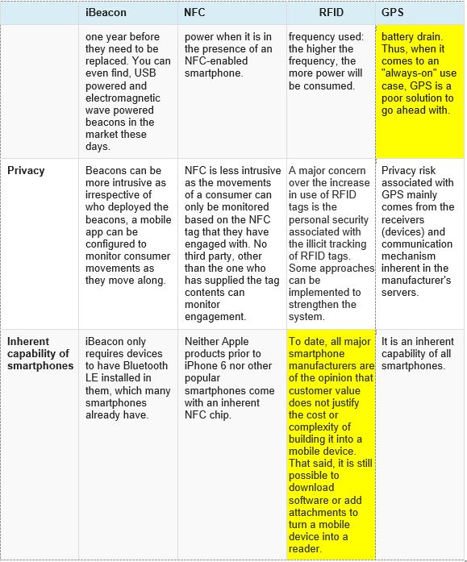

# Architecture

### Index
- [Introduction](https://github.com/stefanofoti/musa/blob/master/docs/Architecture.md#introduction)
- [Architecture and components](https://github.com/stefanofoti/musa/blob/master/docs/Architecture.md#architecture-and-components) 
  - [List of components](https://github.com/stefanofoti/musa/blob/master/docs/Architecture.md#list-of-components)
    - [Software](https://github.com/stefanofoti/musa/blob/master/docs/Architecture.md#software)
    - [Hardware](https://github.com/stefanofoti/musa/blob/master/docs/Architecture.md#hardware)
    - [Technologies](https://github.com/stefanofoti/musa/blob/master/docs/Architecture.md#technologies)
- [IoT aspects](https://github.com/stefanofoti/musa/blob/master/docs/Architecture.md#iot-aspects)
- [Sensor Network](https://github.com/stefanofoti/musa/blob/master/docs/Architecture.md#sensor-network)
  - [About the messages sending](https://github.com/stefanofoti/musa/blob/master/docs/Architecture.md#about-the-messages)
   - [About the main board's messages](https://github.com/stefanofoti/musa/blob/master/docs/Architecture.md#about-the-main-boards-messages)
    - [About the choice of having a second Raspberry Pi](https://github.com/stefanofoti/musa/blob/master/docs/Architecture.md#about-the-choice-of-having-a-second-raspberry-pi)
- [Backend and smartphone frontend](https://github.com/stefanofoti/musa/blob/master/docs/Architecture.md#backend-and-smartphone-front-end)
  - [Keeping track of user's visit](https://github.com/stefanofoti/musa/blob/master/docs/Architecture.md#keeping-track-of-users-visit)
  - [Frontend](https://github.com/stefanofoti/musa/blob/master/docs/Architecture.md#frontend)
- [Cloud](https://github.com/stefanofoti/musa/blob/master/docs/Architecture.md#cloud)
- [About the choice to use Bluetooth Low Energy](https://github.com/stefanofoti/musa/blob/master/docs/Architecture.md#about-the-choice-to-use-bluetooth-low-energy)
  - [RSSI and Kalman Filter](https://github.com/stefanofoti/musa/blob/master/docs/Architecture.md#rssi-and-kalman-filter)
- [References](https://github.com/stefanofoti/musa/blob/master/docs/Architecture.md#some-references)

TO DO: forse riordinare meglio ed aggiungere nuovi paragrafi

------------------------------------------------------------------------------------------------------------------------------------------------------
### Introduction

This application needs a lot of components to work properly. The three main parts are: 
- the sensor network 
- the interaction between the client on the smartphone and the backend on the cloud 
- cloud services, which comprehend also a machine learning algorithm 
 
Near every piece of art or cluster of artworks, there is a board, which communicates with the user's phone to understand how much time he spends near it. The data are sent to the cloud platform to be stored and elaborated. A machine learning algorithm creates customized tours according to the
information collected and on the reports generated for each user at the end of the visit. The user's smartphone is connected with the backend to provide interaction with the visitor. 

## Architecture and components

The architecture is the following: 

### List
#### Hardware
- STM-Nucleo boards (x pieces of art or cluster of artworks) 
- 2 Raspberry Pi boards (1 to be the gateway, the other for backup) 
- Wi-Fi and BLE hardware for STM-Nucleo 
- user smartphone 

#### Software
- Azure Cloud Platform: 
  - Azure Event Hub 
  - Azure IoT Hub 
  - Azure Database 
  - Azure Machine Learning 
  - Azure Web App Service Plan 
- Google Docs 
- RIOT OS
- Python
- Angular and Bootstrap

#### Technologies
- Bluetooth Low Energy (BLE) 
- MQTT-SN 
- MQTT 

### IoT aspects
We substain that MuSa project is filled of IoT components and arguments.
- The *Data collection and Data analysis* are two of the main goals of the IoT. With MuSa, we collect informations about visitors and users for several reasons like to provide personalized tours and improve those tours through visitor's behavior. Even if it is not planned in our project, the curators may use the collected data also for several others aspects, like reorganize the museum's artworks positioning, simply analyzing those data. TO DO: attuatore delle opere con piu visite
- The *Edge computing* is a widespread computing paradigm used in IoT; we pre-process the data collected to send them to the cloud in a better structured way and to save on the number of messages sent, for better exploit the Cloud's free-plan
- We use two different types of *Boards*: a Raspberry Pi and a ESP32 (that is supposed to be an STM32 Nucleo)
- The use of a *Cloud service*: Microsoft Azure
- The use of *MQTT*: a famous lightweight messaging protocol in IoT for small sensors and mobile devices
- The use of *Bluetooth Low Energy (BLE)* technology
- The use of *Devices* sending beacons, that in our case are smartphones

### Sensor network

The boards we decided to use are STM-Nucleo, one near each piece of art or cluster of artworks, and the user's smartphone communicates with them via Bluetooth Low Energy (BLE). In the museum there is also a Raspberry Pi board that serves as a gateway, to forward the data collected to the cloud structure. 
We decided to use a Raspberry Pi because we needed a little more power and memory to execute the following tasks: connect to Azure and forward data to it (quite complex for an STM-Nucleo due to keys you would need to store and manage for authentication) and do some pre-processing of raw messages. 
We noticed that we didn't need to have a single STM-Nucleo board near each piece of art: if there are some artworks that are very close to each other, we can treat them as a single artwork. In fact, what we really need to do is proximity detection, that is, understand the pieces of art which are nearest to the user in real time to provide him valuable and funny information about them, and to understand if he's following the tour proposed by MuSa. 

#### About the messages

The main idea is the following: the user's smartphone sends BLE beacons periodically, and the boards are able to detect them. A board sends every second a message to the gateway Raspberry via MQTT-SN with the data contained in the beacons received. The main board does some pre-processing and then sends a message every 5 seconds to the cloud through an MQTT channel. This is a report about the pieces of art each user looked at for the past 5 seconds. Here there is an example: 

{ 
&nbsp;"timestamp":"2020-2xxx", 
&nbsp;"users":[{ 
&nbsp;&nbsp;"id":"A1:B2:C3:D4:E5:F6", 
&nbsp;&nbsp;"artworks":[1,1,1,2,2] 
&nbsp;&nbsp;}, 
&nbsp;&nbsp;{ 
&nbsp;&nbsp;"id":"A1:B2:C3:D4:E5:F7", 
&nbsp;&nbsp;"artworks":[2,2,2,2,2] 
&nbsp;&nbsp;}] 
} 

and it's a JSON object. Each message has a timestamp and a list, which contains, for each element, the id of the user (his MAC address sent with the BLE beacon) and a tuple "artworks". In this tuple in every cell is stored the id of the piece of art the user was observing at that second. Note that it is made of 5 cells, because the gateway board collects the data about the beacons sent by the other boards, puts them together, and generates this report that contains what the users did in these 5 seconds. 

##### About the main board's messages
Notice that we decided to use a main board as a gateway because, besides the fact that in this way we can send better pre-processed data by doing some edge computing, we can have a significant saving in terms of the number of messages sent. Think about the fact that the free plan of our cloud service, Microsoft Azure, provides 8000 messages-per-day; with a main board that sends a single message that groups all the messages received from every single board, considering 1 message every 5 seconds, MuSa can work about 11 hours. If every board sends each message by itself, the free plan will expire in a few minutes. 

##### About the choice of having a second Raspberry Pi
For reliability reasons (more details in the [Evaluation document](/Evaluation.md)), we decided to keep also another Raspberry board in hot standby, since having a main gateway board exposes us to the risk of having a single point of failure; when the main gateway forwards the report to the cloud, also the second "backup board" receives it. If it doesn't receive any report for some time, it will assume that the main gateway has suffered a failure, and it will take its place to avoid the stop of the service. 

### Backend and smartphone front-end

The backend of the application lives in the cloud and takes care of the interaction with the user's smartphone. MuSa accompanies the visitor,proposing him a personalized tour, providing information about the different artworks, and making sure he's enjoying the itinerary. 
When the user arrives at the museum connects to the web app with his mobile and the application runs until the end of the visit. At the end of the tour, it asks the user to fill in a survey to provide feedback about the quality of the service. This answers are stored in a Google Document, in a way that makes them easily accessible to the machine learning algorithm. 

#### Keeping track of user's visit

A message that arrives at the cloud from the gateway board is sent to the backend thanks to Azure's Event Hub. The application has for each user a record inside the DbContext, which is a database in the main memory, where the messages relative to that specific user are stored. Each time a new report arrives from the gateway board, for each user the application checks if there is a record, if there isn't a new one is initialized. Corresponding to each user, there is a list of the pieces of art visited: for each piece of art there is also an integer that keeps track of the seconds a user has spent looking at that artwork. 
The tuple corresponding to the user is inspected: if the last artwork visited according to the Context is the same as the one in the first cell of the tuple, the integer is increased by one, otherwise, a new element is appended to the list with the number 1 associated. Only the last element of the list can be updated. 
If the artwork in the second cell is the same as the one in the first cell, the integer of that specific piece of art is again increased by one, otherwise, a new element is initialized as before. There can be different elements of the list that have the same piece of art's id, but with a different integer value associated. 
For example, after receiving the message written above, two records for the two users exist: 

- Record 1: 
  "id":"A1:B2:C3:D4:E5:F6", 
  "list":[{ 
  &nbsp;"artwork_1":"3", 
  &nbsp;"artwork_2":"2" 
  &nbsp;}] 

- Record 2: 
  "id":"A1:B2:C3:D4:E5:F7", 
  "list":[{ 
  &nbsp;"artwork_2":"5" 
  &nbsp;}] 

If a new message like this arrives: 

{ 
&nbsp;"timestamp":"2020-2xxx", 
&nbsp;"users":[{ 
&nbsp;&nbsp;"id":"A1:B2:C3:D4:E5:F6", 
&nbsp;&nbsp;"artworks":[2,2,1,1,1] 
&nbsp;&nbsp;}, 
&nbsp;&nbsp;{ 
&nbsp;&nbsp;"id":"A1:B2:C3:D4:E5:F7", 
&nbsp;&nbsp;"artworks":[2,2,2,2,2] 
&nbsp;&nbsp;}] 
} 

the records would be updated in this way: 

- Record 1: 
  "id":"A1:B2:C3:D4:E5:F6", 
  "list":[{ 
  &nbsp;"artwork_1":"3", 
  &nbsp;"artwork_2":"4" 
  &nbsp;"artwork_1":"3" 
  &nbsp;}] 

- Record 2: 
  "id":"A1:B2:C3:D4:E5:F7", 
  "list":[{ 
  &nbsp;"artwork_2":"10" 
  &nbsp;}] 

Please notice that from Record 1 we can deduce that the user A1:B2:C3:D4:E5:F6 has returned near the artwork with id "1". Thanks to duplicates in the list we can have an understanding of the path the user is following while visiting the museum. 
When a user terminates his tour, the list corresponding to him is saved to the Google Doc that is the dataset for the machine learning algorithm, together with the profile of the user for further tuning of the tours (using this data we can understand which pieces of art were most liked by a specific type of user). 

#### Frontend

If a user decides he only wants to help collect data, the only thing MuSa will do is send beacons, and all the work will be done by the rest of the architecture described in a completely transparent way for the user, who will not be disturbed in the slightest. 
If a user wants to follow MuSa for a personalized tour, the application will present the visitor with a survey to outline his profile. Once the type of user is identified, MuSa asks for the backend an appropriate tour, which will be fetched from Azure's database, where all the tours are stored, and will propose it to the user. During the itinerary the frontend, in addition to periodically send beacons, will periodically ask the backend for information about the user's current location (the last piece of art visited), and interaction will be dealt accordingly. 

### Cloud

It's a crowded place: here we can find the IoT Hub, our application code (backend and frontend) with its database and the machine learning algorithm. 
Azure Machine Learning takes as input the dataset saved on the Google Doc, elaborates it creating the tours for the different type of users (the personas we identified) and it pushes them into the database of the application. It runs as a batch. 
The database contains also information about the pieces of art and when the application needs to present the user a tour or details about an artwork, it will make a query to it. 

### About the choice to use Bluetooth Low Energy

We need to use BLE to understand the pieces of art the user is nearest to. So, what we really need to implement is proximity identification more than a complete indoor localization. To achieve this goal we could also use other technologies, therefore we decided to compare the different solutions before making a definite choice. In particular, we considered the most used technologies for these types of problems, which are BLE (we found documentation about the particular iBeacon protocol, but the following considerations can be generalized), NFC, RFID, and GPS. Reading various articles, we made a summary with this table, where the cells which contain aspects that were a disadvantage with respect to our objectives are colored yellow, and we marked in red the cells which contain major drawbacks that made us decide to discard the corresponding technology. 

 

To see the table more clearly, consider also looking at the original ([Word file](src/architecture/BLE_vs_others.docx)). 

Now let's consider briefly the technologies presented one by one: 
- GPS: it's widely used for localization, but it doesn't really serve our purposes. Moreover, its accuracy indoor is not very high and it consumes a lot of energy, and we don't want our user's smartphone to remain with low battery after or during the visit, this could bother him. 
- NFC: it would have been a good alternative, but the major issue is that it has a range too small (up to 10 cm), which would definitely be not enough to understand if a user is near a piece of art.
- RFID: it was a close call. Different factors pieced together made us discard this technology. First of all there's the problem of accuracy. To achieve good proximity identification we would need a range wider than 1 m (some users may like to admire artworks, especially bigger ones, from a longer distance), so we would have used Ultra High Frequency (range up to 5 - 6 m). The problem is that the accuracy with this frequency drops and the energy consumed is more. 
There is also the problem that is technology is not natively supported by smartphones, and we don't want to bother our users by asking them to install additional software or to carry around an RFID tag, we want the process to be as transparent as possible to the user, especially considering the ones that don't want to be disturbed during the visit but are still willing to participate in data collection. 
- BLE: this technology met all our requirements: it's not expensive, compatible with mobile phones, has a wide enough range, can be used to do proximity identification. The only issue is the accuracy, but as explained in the Evaluation document, there are techniques to mitigate this disadvantage. 

#### RSSI and Kalman Filter
Since one of the general comments about our project was that the BLE technology is not very exciting for indoor positioning, also because sometimes it is not very accurate, as suggested we implemented the use of RSSI crossed to the inclusion of a Kalman Filter for improving the precision of our system.  
**Received signal strength indicator (RSSI)** is a measurement of the power present in a received signal: we get the RSSI from each beacon and we can estimate how much is close a user to an artwork and also which is the closest artwork.  
The **Kalman Filter** is an algorithm that uses a series of measurements observed over time, containing statistical noise and other inaccuracies, and produces estimates of unknown variables that tend to be more accurate than those based on a single measurement alone. The Raspberry-Pi applies the Kalman Filter to a series of beacon's RSSI recieved, so in this way it can avoid abrupt variations or it can ignore strange values caused by wrong beacons measurements.

### Some references
These are the articles we mainly consulted: 

- RFID vs BLE: https://blog.beaconstac.com/2015/10/rfid-vs-ibeacon-ble-technology/

- BLE vs NFC vs GPS: https://blog.beaconstac.com/2015/07/ibeacon-vs-nfc-vs-gps-which-indoor-location-technology-will-your-business-benefit-from/

- RFID frequencies: https://rfid.it/cos-e-la-tecnologia-rfid/

- RFID battery: https://www.nordicid.com/resources/expert-article/how-different-power-saving-options-affect-your-rfid-readers-battery-life-and-power-consumption/

- RFID security and privacy: https://www.electronics-notes.com/articles/connectivity/rfid-radio-frequency-identification/security-privacy.php

- Advantages of BLE and historical comparison: https://blog.roambee.com/supply-chain-technology/evolution-in-supply-chain-visibility-barcodes-to-rfid-to-ble-beacons
