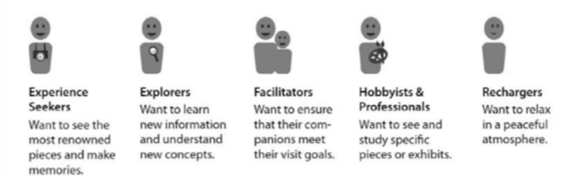
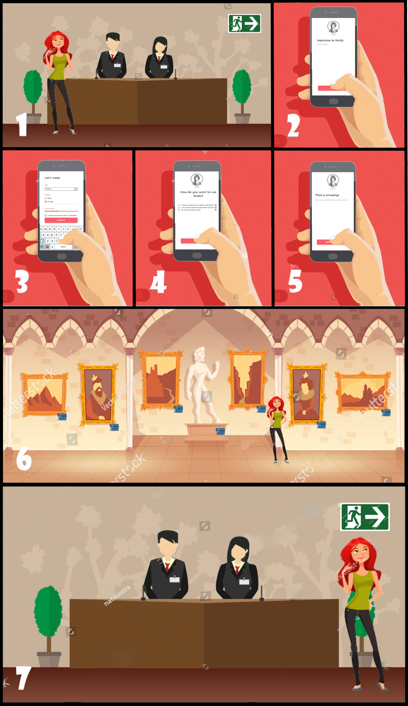

# Design

------------------------------------------------------------------------------------------------------------------------------------------------------

### Index
- [Concept](https://github.com/stefanofoti/musa/blob/master/docs/Design.md#concept)
- [How MuSa comes to life](https://github.com/stefanofoti/musa/blob/master/docs/Design.md#How-MuSa-comes-to-life)
- [About the personalized tour topic](https://github.com/stefanofoti/musa/blob/master/docs/Design.md#About-the-personalized-tour-topic)
- [About the interaction with artworks](https://github.com/stefanofoti/musa/blob/master/docs/Design.md#About-the-interaction-with-artworks)
- [About the beacons in museums](https://github.com/stefanofoti/musa/blob/master/docs/Design.md#About-the-beacons-in-museums)
- [Profiling users and personas](https://github.com/stefanofoti/musa/blob/master/docs/Design.md#Profiling-users-and-personas)
- [User experience and storyboard](https://github.com/stefanofoti/musa/blob/master/docs/Design.md#User-experience-and-storyboard)
	- [Collect data](https://github.com/stefanofoti/musa/blob/master/docs/Design.md#Collect-data)
	- [Do a personalized tour](https://github.com/stefanofoti/musa/blob/master/docs/Design.md#Do-a-personalized-tour)
	- [The RGB led](https://github.com/stefanofoti/musa/blob/master/docs/Design.md#the-rgb-led)
- [references](https://github.com/stefanofoti/musa/blob/master/docs/Design.md#references)

------------------------------------------------------------------------------------------------------------------------------------------------------

### Concept
MuSa is an "experience manager" that collects data and provides interactive-customized tours for museum visitors. A user can decide to use the app in two ways: 
- just collect data: the user isn't interested in personalized tours but gives the consensus to data collection. 
  This will allow our application to identify which pieces of art are the most appreciated and how users move in the building. 
- do a personalized tour with MuSa: depending on the user's profile, MuSa will suggest him a tour, providing an interactive experience. 
 
Obviously, the user can refuse both alternatives, and just visit the museum without interacting at all with our application. 

------------------------------------------------------------------------------------------------------------------------------------------------------

### How MuSa comes to life
We thought about many commons issues that a visitor has when he visits a museum, such as:
- limited time to take a full visit
- meeting on his path of some pieces of arts that do not match with his interests
- the desire of having more details about an opera, but at the same time he does not like to have a physical or audio guide for several reasons

Since the basic concept of MuSa is to put the user at the center of the experience, we started from these points for building something that could satisfy the user needs.

------------------------------------------------------------------------------------------------------------------------------------------------------

### About the personalized tour topic
The argument of personalized tours has been obviously explored before.
First of all, we can report some examples of the most common ways to visit a museum, referring to some famous museums [1]:

- *Rijksmuseum Amsterdam (Human-guided tour)*: the visitor follows a human guide, which selects artworks and gives corresponding information to visitors using speech, gestures or extra material
- *Rijksmuseum Amsterdam (Audio tour)*: most artworks are labeled with a number and they are coupled to an audio track on the visitor’s audio device
- *Tate Britain (Online tour)*: the visitor sees a virtual museum representation on a museum map. Rooms can be selected and each room contains a set of artworks
- *Metropolitan Museum of Art (Online tour)*: the visitor can select six different virtual reality rooms and then navigate the virtual rooms and the artworks inside the rooms
- *Van Gogh Museum Amsterdam (Multimedia tour)*: the visitor walks through the museum following a timeline of Van Gogh’s life. Artwork information can be seen on a PDA (Personal Digital Assistant) from the artwork list
- *Netherlands Architecture Institute Rotterdam (Multimedia tour)*: artworks have sensors that can be scanned using a PDA. If a sensor is scanned, the corresponding information will be presented on the PDA.

Most tour modalities contain a fixed list of artworks, which is the same for everyone or for visitors from the same predefined user groups (e.g. groups of tourists, students, experts). The second problem is the lack of connection between online tours and on-site/multimedia tours, which are usually separated into two tours without any connections. These two problems became the main challenges in building personalized tours [1].

The ambition of MuSa is precisely to relate these two aspects, the technological and interactive part with the on-site tour.

The purpose of museums has shifted from merely providing static information of collections to providing personalized services to various visitors worldwide, in a way suiting visitors’ personal characteristics, goals, tasks, and behaviors. Personalization enables changing “the museum monologue” into “a user-centered information dialog” between the museum and its visitors (Bowen and Filippini-Fantoni 2004). This interactive dialogue occurs not only in the real museum but also in the “virtual museum” (Schweibenz 1998) on the museum Web site. Museums are increasingly experimenting with and implementing more personalized and interactive services on their own Web sites. Visitors spend time on the museum Web sites, e.g. to discover interesting artworks, prepare a museum tour, or learn related knowledge about artworks. This brings a challenge for museums to provide a personalized and extended museum experience for visitors in an immersive museum environment, which includes both the virtual museum (online) and the real museum (on-site). [1].

------------------------------------------------------------------------------------------------------------------------------------------------------

### About the interaction with artworks
*Engaging visitors with the right information at the right time and with the most effective type of interaction during their museum experience is one of the crucial issues curators are keen to invest effort in to make visits enjoyable, memorable, and instructive for their varied audience* [2].

In addition to the personalized tours, the interaction with the artworks in the museum makes the experience more immersive for sure. This is the other purpose of MuSa, to let the user satisfy his curiosity about a piece of art, doing it in an enjoyable way, differ from common research on the web and without the need for guides or audio-guides.

The interaction can also make the experiences different from each other because the artworks' responses could be different, for example:
- *Triennale Milano Permanente*: the exposition about the Italian Design provides several "Grillo Phones" (a historical piece of Italian design) near some of the most important operas. The visitor can use these phones typing some provides numbers and the designer of that opera could (or not) answer to the call; he will tell a curiosity about the time he ideated his work.
- *Mexico stand - Expo 2015*: during the tour, some totems along the path allowed the visitor to choose a different type of information, based on his interests. At the end of the tour, the last totem gave the possibility to print a summary receipt that recapped all the choices that the visitor made during his tour

------------------------------------------------------------------------------------------------------------------------------------------------------

### About the beacons in museums
The interaction with MuSa will be based on beacons.
Beacons are widely used in smart museums. We can report some famous museums that used them in their interactive expositions [3]:

- *Sydney Art Project*: Kaldor Public Art Projects along with Australian artist Jonathan Jones created an exhibition entitled “Barrangal Dyara" [4], to share and educate about aboriginal culture. The mobile app delivered content at specific locations, with push notifications sent when visitors came within range of beacons positioned at various points on the site of the 1882 fire. Signs and reminders about the need to enable Bluetooth were placed throughout the area, along with information about the availability of the app for anyone who wasn’t already aware of it. The feedback from guests was positive and the use of beacons to power the app that supplemented the display has drawn praise.

- *The Groninger Museum*: the Groninger Museum is the first museum in the Netherlands where beacons have been implemented. The technology is available in the exhibition “The Collection”, from March 29, 2014, onwards. It is used to send interactive content on artworks to visitors using the app. Visitors who do not have a compatible smartphone or tablet can rent these at the museum so that they have access to interactive media. Thanks to this application, the visitor has access to additional video and audio clips, background information, and detailed photos of the artworks. A mix of interactive media excites, amazes, and inspires a unique experience.

- *New Museum in New York City*: for the UN’s International Day for Mine Awareness and Assistance in Mine Action on April 4th, New Museum in New York City hosted an exhibit that used iBeacons to simulate a virtual minefield and let anyone experience the danger of landmines. Visitors were required to download the Sweeper app. Using beacons, the Sweeper app detected transmitters hidden behind the exhibits. When a person came too close to a transmitter, it acted as a landmine and detonated, filling the user’s headphones with a jarring explosion followed by an audio testimony of someone’s actual experience. This was inarguably the most unique use of beacons one has seen so far.

Making a more interactive experience, museums are changing the way they educate, guide, and tell stories to visitors. Location-powered mobile apps provide visitors a personal tour guide, just in the palm of their hands.
Contextual information can be triggered to show more details about an artwork a visitor is looking at, or to inform visitors about other facilities. Beacons can also be used to measure dwell times, measuring how much time visitors spend at different locations of the museum, or which exhibits are most popular. The museum can now understand if an exhibit is popular by itself or if it is because of its placement at a particular location.

This is what basically the MuSa project wants to do through beacons: give an enjoyable experience and improve the services.

------------------------------------------------------------------------------------------------------------------------------------------------------

### Profiling users and personas
To understand which "type" of users will interact with our application, we started from the data provided by "Museo Sapieza dell'Arte Classica"
in the PDF they provided to our IoT class. In this slide 

they summarize the profiles of their visitors. We decided to take them as the first model for our personas. 
To better tune this model, we broadcasted a questionnaire online to a large number of people, through which we tried to understand
general information about users, and how do they fit in the categories that we already had: [form](https://docs.google.com/forms/d/e/1FAIpQLScHOCgfRfKwQW0pYXJSsJNKqSPaXVRaSIak9BZPZeact22I4w/viewform). 
We analyzed the data collected and found that the most frequent types of users where the Hobbyist/Professional, the Recharger, and something in between the Experience Seeker and the Explorer, which we fused into the Fun Explorer. 
These three categories were given life in our personas: 

##### Hobbyst/Professional 

 

##### Fun Explorer 

 

##### Recharger 

 
The survey MuSa presents to the user to profile him to give him a personalized tour is inspired by the one shown in this paper: [Capturing the Visitor Profile for a Personalized Mobile Museum Experience: an Indirect Approach](http://ceur-ws.org/Vol-1618/HAAPIE_paper1.pdf). This reserach group did an experiment similar to our project, and in particular, to profile users they asked them about a movie they would like to watch, and about their favourite artstyle between different ones to picture Mona Lisa. 

------------------------------------------------------------------------------------------------------------------------------------------------------

## User experience and storyboard

We created two storyboards for both use cases (just collect data or do a personalized tour). 
When a generic user enters the museum, he is asked by a staff member if he wants to try MuSa. They'll be given the reference to the app and
the user will find himself in the Home page, where a brief explanation of MuSa's services will be written. 

### Collect data
The protagonist of this storyboard is Elena, and we figured she'll just want to collect data: 

1. Elena has finally some free time, so she decided to visit a museum. She has been looking forward to studying some specific pieces, and has planned a tour accordingly. She arrives, and the receptionist asks her if she wants to try MuSa.
2. Elena downloads the MuSa app the receptionist pointed her out. She sees the home page. There she can find a brief introduction about MuSa and its services. She presses “Meet MuSa” to proceed to the next page.
3. Elena finds a short survey she needs to complete. She is a little irked by this, but the questionnaire is short and easy to answer, so it’s not too much of a bother. It gathers basic data about her to understand to which persona she belongs and to, eventually, produce a customized tour for her. She presses “Continue”.
4. A new page loads. Elena has to say how she would like to use MuSa. She has already a clear idea of what she wants to see, and she doesn’t want to be bothered. However, she likes the idea of gathering useful data for her loved museum, so she gives her consensus to collect information.
5. Elena sees MuSa’s gratitude and is glad she can help. She clicks “Let's go” and proceeds to the visit.
6. Elena visits the museum according to her schedule. The app collects data about her location and how much time she spends near every piece of art. This is done thanks to the communication between the boards and her smartphone. All the work is done in background, so Elena doesn’t even notice. She is able to enjoy her visit without being bothered.
7. Elena leaves, satisfied with her visit. The app has stopped collecting data. The museum curators are happy with the information they’ve gathered.

The museum staff and Elena will both be happy, since they will have data to better their services, and Elena has been able to do the tour she
had planned without being disturbed. 

------------------------------------------------------------------------------------------------------------------------------------------------------

### Do a personalized tour

Here we imagined what would be Enea's experience. He'd like to try MuSa, and he will exploit all the functionalities offered. 

1. These days Enea wants to try something out of his comfort zone, so he decides to visit a museum of classical art. When he arrives, the receptionist asks him if he wants to try MuSa.
2. Enea downloads the MuSa app the receptionist pointed him out. He sees the home page There he can find a brief introduction about MuSa and its services. He presses “Meet MuSa” to proceed to the next page.
3. Enea finds a short survey he needs to complete. He is curious about the new application and happily complies. It gathers basic data about him to understand to which persona he belongs and to, eventually, produce a customized tour for him. He presses “Continue”.
4. A new page loads. Enea has to say how he would like to use MuSa. He likes to try new things and being advised about the best itinerary for him, rather than wander around without a guide, sounds good to him. Therefore, he decides to get a customized tour and presses “Done”.
5. Enea sees MuSa’s exited response and he’s in for a ride. He clicks “Let's go” to proceed.
6. MuSa proposes a tour tailored to his personality.
7. Enea visits the museum following MuSa. The app collects data about his location and how much time she spends near every piece of art, while also accompanying him through the rooms and providing useful information about the artworks exposed. This is done thanks to the communication between his smartphone, the boards, and the backend of the application. Enea is glad he decided to use MuSa, he’s learning new things and he feels entertained.
8. Enea leaves, satisfied with her visit. The app has stopped collecting data. The museum curators are happy with the information they’ve gathered, and with the fact that a new visitor had a  good time in their museum.

#### The RGB led
We decided to implement a minor feature through an RGB Led actuator, positioned on each board, to show the most appreciated artworks in the current day (easily switchable to a weekly or monthly period). The Led is lighted up with a green light if an artwork is in the top ten of the most liked operas, based on how much time each visitor spends in front of it. We thought it could be pleasing for users to see the trends in the museum visits.

------------------------------------------------------------------------------------------------------------------------------------------------------

### References
- [1] Cultivating Personalized Museum Tours Online and On-Site: https://www.researchgate.net/publication/233521881_Cultivating_Personalized_Museum_Tours_Online_and_On-Site
- [2] https://www.mesch-project.eu/shaping-personalized-museum-experiences/
- [3] https://www.mocaplatform.com/blog/how-location-based-marketing-is-transforming-the-museum-experience
- [4] Kaldor Public Art Projects website: http://kaldorartprojects.org.au/project-32-jonathan-jones
