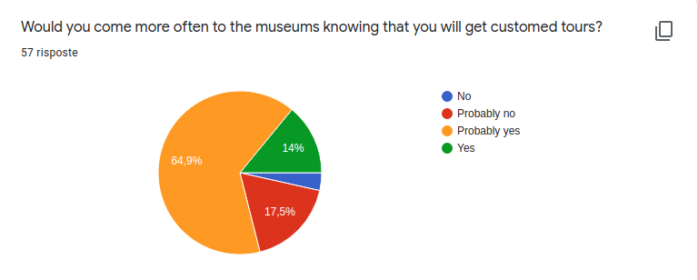

# Evaluation

In this document we will give a brief introduction on the evaluation methods we thought of using for our project. 
We will evaluate with different methods the user experience and the technologies used. In particular, the quality of the hardware and software components will be measured taking into account their peculiarities, but also the quality of the whole system. 
However, keep in mind that this is a project developed for an IoT course, so we will cover this section to provide a comprehensive analysis, but it will not be at the enterprise level. 

## Objectives

With our application, we tried to realize something useful for both the museum and the users. In particular, we want to satisfy these demands: 
- make the museum more attractive and collect data useful for the curators 
- make sure people will enjoy their visits to the museum 

MuSa meets these requirements by collecting the users' movements in the museum, storing the data and then analyzing them to provide customized tours. 

## User experience

The happiness of users is important, and we want to make sure they enjoyed our services. MuSa is designed to understand the needs of the visitors: 
- the user has limited time, therefor MuSa will provide him a tour with only the most relevant pieces of art (based on the user's interests) 
- the users want some curiosity about a statue or its historical or mythological background, and MuSa will give him all the knowledge he wants 
- the user doesn't want to do a guided tour of the museum, but he would like some support all the same, and MuSa will be happy to accompany him 

To measure the users' appreciation we are going to use the following UXEMs (User Experience Evaluation Methods): 
- a _Moment_ method: through the interaction with MuSa we can understand the visitor's mood (for example, if he is not following the proposed tour we can assume he probably is not enjoying it). 
 Furthermore, for this purpose, we suggest to use also a commercial tool like PrEmo that allows MuSa to know the user's feeling in real-time 
 _Link_: https://www.premotool.com/ 

- an _Episode_ method: at the end of the visit the user will be asked to fill a short survey about his experience. This questionnaire can be implemented using also the AttrakDiff tool (_Link_: http://www.attrakdiff.de/index-en.html). 

### Users' feedback

During the developement process we're keeping track of the opinions of the users to understand if we're effectively building something of value. In particular, the following results of the surveys we made are quite encouraging. 

 
From the above graph, we can see that the majority of the users would at least be curious to try MuSa. 
The results below instead testify that our application could be useful for the museum to attract more visitors, thanks to making their experiences there more enjoyable. 

 

Looking at the next graph, we can be reassured on the fact that we're catching the main needs of the users, since, a part from some peculiar suggestions, the majority of them doesn't feel the need to point out more functionalities to add with respect to the ones already presented. 

 

We're also taking into account our user's opinion to build an interface which can be to their liking: 

Through one of our questionnaires, we got the opinion of Giulia: *"I like the fact that I can obtain more information about an artwork, or the basic info, on my smartphone because the labels of the operas are often crowded or written in a too-small font"*

## Technology
Under the technological stack, MuSa uses many different hardware and software solutions. We decided to evaluate each single part and the overall system. Further details are in the following paragraphs. 

### Overall evaluation
Software quality is defined by a set of regulations and guidelines by ISO/IEC 9126-1. We used a criteria-based evaluation which gives a measurement of quality in several areas, including understandability, documentation and portability (the original document that we used as a model is [this one](https://software.ac.uk/sites/default/files/SSI-SoftwareEvaluationCriteria.pdf?_ga=2.151004923.318823281.1587909367-13184924.1587909367)). Of course, we did not use the criteria we did not need for, so we produced this lighter customized version:

[MuSa Criteria](/src/evaluation/MuSa_criteria.pdf)  

### Sensor network
The sensor network evaluation has to consider aspects like: 
- Power consumption
- Communication complexity
- Scalability
 
The suggested board for the project is STM Nucleo. We chose to keep it because of its low power consumption and low price; it is also widely used, rich of documentation and examples. The same can be said for the Raspberry Pi board, even if, beign more powerful, is more expensive. 

This is not the only possible solution. Among the others, a great idea may be to convert our [server based positioning to client-based positioning](https://developex.com/blog/indoor-navigation-with-ble/) and to use BLE (Bluetooth Low Energy) tags, like _NRF51822 ibeacon tag_. Their cost is very low, just 3-4 euro/pcs. 

Our STM-Nucleo costs about 10-15 euro, but it is much more flexible than a BLE tag and offers many possibilities for further development ideas. 
The only drawback is that also the cost of the hardware to make enable the board to send BLE messages (BLE + Wi-Fi expansions required), which is around 20 euro.  
The cost of a Raspberry Pi board can range from about 20 € to much more, as functionalities are added, so it's important to evaluate carefully each specific use case to select the cheapest possible option. 

A brief evaluation about the choice of using BLE has been done, but since it was a matter of deciding which technology to use to track the user inside the museum, we put the analysis in the [Architecture document](Architecture.md) 

#### Complexity and responsiveness evaluation

We need our system to be responsive to follow the user in real-time during his visit, but at the same time we also don't want to flood our network with messages, keeping the complexity low, also to save the board's power. We need to find a trade-off between these two needs. Therefore, we did a brief analysis of the system and decided to use a Raspberry Pi board as a gateway (more on this in the [Architecture document](Architecture.md)). This also affects the cost: we want to push the limits of our free plan to exploit it to the fullest (the limit of messages we can send to Azure is 8000 per day), so that we can pay as less as possible. 
This can be achieved by taking advantage of edge computing: we do data pre-processing in the gateway to aggregate messages of different boards and send to Azure a single report. The Raspberry also acts as a sort of bridge, taking MQTT-SN messages and transforming them into MQTT ones. Let's do a short evaluation in terms of complexity and responsiveness of this system, let's consider the following scenario: 

- we have 30 STM-Nucleo boards that send 1 message per second

- raw data is sent to Azure: this means that there are around 30 messages * 60 s = 1800 messages each minute, which means that in 8000 / 1800 = 4,4 minutes the free plan would expire.

- Edge computing: instead of sending the messages directly to Azure, they are collected by the gateway, which instead sends to the cloud a report every 5 seconds. So we have 60 / 5 = 12 messages per minute, which means that the free plan would last for 8000 / 12 = 666,66 minutes, which is 11,11 hours.

So we have 5 minutes vs 11 hours a day, the advantages of the edge computing architecture are immense! We could have a museum with 30 boards use our system for free each day (unless it stays open for more than 11 hours). 

#### Evaluation and improvement of BLE accuracy

##### Techniques and considerations that may help to achieve better accuracy

BLE accuracy is a major issue, and one of the principal weaknesses of this technology. To tackle this matter, the possible approaches are both at the physical level and the software level. 
As described in ([this article](https://proximi.io/accurate-indoor-positioning-bluetooth-beacons/)), adopting some precautions can help achieve better performances, in particular: 
- to have maximum efficiency for a deploy, it would be best to have a detailed map of the environment (with the scale), to better place the boards
- the boards should be positioned on the walls, at a 2 m height more or less. It's better if there are no obstacles between them and the user so that he can see them (there is "line-of-sight").
- the boards should not be placed near metallic surfaces, they could worsen the interference. 
 

Now, for a more sophisticated solution, an effective method could be the one described in this paper: [BLE Beacons for Indoor Positioning at an Interactive IoT-Based Smart Museum](/src/evaluation/BLE_paper.pdf), by _Petros Spachos, Senior Member, IEEE, and Konstantinos N. Plataniotis, Fellow, IEEE_ which came out on the 21st of January of 2020. 
They built a system similar to what we would like to create: they used beacon tags and an Android application to perform some activities, among which are included client-based positioning and proximity detection. The position of the user is determined using the RSSI (Received Signal Strenght Indicator) of the beacons. They conducted three main experiments to evaluate the beacons' accuracy and found some interesting results: 
-  beacons can be placed anywhere without interfering with any other wireless communications
- the location accuracy of the beacons in a complex environment is sufficient for an application such as the smart museum when errors within a few meters might be acceptable
- when the receiver is close to the beacon the detection estimation accuracy is acceptable. At the same time, as the distance between neighboring beacons increases the detection estimation accuracy is more challenging
- proper placement of the beacons can improve the system accuracy
  
A transmission range between 2 - 5 m should be enough for an application in a smart museum, and the RSSI from the beacon can be used to find the distance between the beacon and the receiver (for further details on the formulas to use have a look at the paper). 
Unfortunately, the environment of a smart museum is prone to noise and interference due to the other beacons, the general construction, and people's movement.

##### Evaluate proximity detection performance

Referring to the same paper, a similar approach to the one that was used to evaluate proximity detection could be useful. First assess the accuracy of the beacon by selecting a given transmission interval (100 ms in the paper, in our case 1 s is sufficient), and start doing trials changing the distance between the sender (the user's smartphone in our case) and the receiver (the various boards). The value that needs to be monitored is the RSSI. A very effective way to improve performances is by using a Kalman filter. In the paper, experimental results in the paper showed that as the distance increases, the RSSI value decreases and has a greater variation from the mean value. This is due to the signal becoming weaker and being affected by other factors like objects in the environment and noise. 

The results obtained in the reserch showed that the estimation error is less than 3 - 3.5 m depending on the characteristics of the environment, but by using a Kalman filter the error can be reduced to be within 2 - 2.5 m. It's very interesting to note that when the error is within 3 m both raw data and Kalman filter have similar performance, therefor if users maintain a comparable distance from the piece of art they want to observe, the implementation of the filter is not needed. 
Similar tests can be conducted on our system, by placing the boards in a specific topology and see if the system can recognize which is the closest while the smartphone is moving. 

A quick note about the Kalman filter: if needed, a way to implement one in Python can be found in this paper: [Implementation of Kalman Filter with Python Language](/src/evaluation/Kalman_paper.pdf). Note that having a Raspberry Pi board as the gateway would allow us to use the filter in the pre-processing computation. 

We asked specific questions to the users about the usual distance at which they admire art, and the results are the following:

 

 

It's possible to see that it's difficult to estimate a precise value, a significant percentage of the visitors don't pay too much attention to this aspect. However, it's safe to assume that for the average case the Kalman filter is not needed, and a proper placing of the biggest pieces of art, like for example, trying to keep them from being to close to other artworks, could decrease interference among beacons enough to avoid using the filter even for distances longer than 3 m. 

### Backend
Our backend code quality will be tested with [CodeCity](https://wettel.github.io/codecity.html). It is a very simple tool that allows to check the most common software metrics in a new way in which software systems are visualized as interactive, navigable 3D cities. The classes are represented as buildings in the city, while the packages are depicted as the districts in which the buildings reside. The more the city is well structured, the higher the code quality is. Further evaluations will be provided [here](src/evaluation/MuSa_criteria.pdf).

##### First Results
We are using Code City during development to understand immediately if some flaws were to appear. So far, the code for the backend looks good: 

 
As it's easy to see, there are no "pathological" patters: no building is too high, and they're quite well distributed among the landscape. The code is modular and "healthy". 

This is the key to read the map: 

Now let's have a look at how MuSa fares with respect to more specific metrics: 

SCREENSHOTS DELLE METRICHE RILEVATE DA CODECITY PER MUSA + few comments if possible

 

### Cloud System
Most of this project lives in the Azure platform, including:  
- backend + frontend ([Azure App Service Plan](https://azure.microsoft.com/it-it/pricing/details/app-service/plans/))
- IoT services ([Azure IoT Hub](https://azure.microsoft.com/it-it/services/iot-hub/))
- Machine Learning algorithm ([Azure Machine Learning](https://azure.microsoft.com/it-it/services/machine-learning/))
- Database ([Azure Database](https://azure.microsoft.com/it-it/services/sql-database/))

We chose Azure among all the cloud services providers seen so far in our IoT course since it looks to be the most suitable for our purposes. Moreover, it has all the needed services out of the box in a single place. 
Since this project is developed as part of our IoT course, the machine learning algorithm will not be evaluated. 

### About the price

#### Hardware
We need as many boards as the number of cluster of artworks and single important pieces displayed in the museum plus one for the gateway; each one costs about 10-15 euro. The cost of the hardware to make the board be able to communicate using BLE (and Wi-Fi) should be considered, for a total of 30 - 40 more or less (considering also the cost of the board). 
The most expensive component would be the two Raspberry Pi boards, which can cost from around 20 € to much more. 

#### Cloud
Azure is a commercial product offering a minority of free services for small projects. Using the [Microsoft Pricing Calculator](https://azure.microsoft.com/it-it/pricing/calculator/) we checked for the cheapest possible solution for study purposes. 
The Azure IoT hub is free until 8000 messages/day. Exploiting our architecture choice to use a main STM-Nucleo board as a bridge for the whole sensor network we can save a big amount messages. 
The Azure Database is free for the previous Azure Database generation (the 4th), with few GB of space, but the fact you can not have any backup possibility is a major drawback. 
The Azure App Service Plan offers for free a complete solution to deploy a full-stack application with both FE and BE. The free solution offers 1GB of storage, 1GB of RAM and a shared CPU. Please note that in such a way you can not keep your application always running. 
Unfortunately the Azure Machine Learning does not offer any free plan, and it starts at about 4 USD/month. 
We attach a short [excel report](src/evaluation/azure_plan.xlsx) to better visualize all the plans. 
It is very easy to scale this plan and evaluate how this affects costs using the [Azure Pricing Calculator](https://azure.microsoft.com/it-it/pricing/calculator/). 

### A word about security

Since this is a project for the IoT course of our master degree, we won't do a detailed security analysis. However, during the development process, we'll try to keep attention to this aspect and to comply with OWASP recommendations to avoid major threats: https://owasp.org/www-project-top-ten/. 

We suggest one of [these](https://owasp.org/www-community/Vulnerability_Scanning_Tools) tools to run security tests.

#### Sensor network's reliability
It's not difficult to see that having a board that acts as a gateway is a single point of failure: if that board stopped working for whatever reason, messages wouldn't be forwarded to the cloud anymore. To avoid a potential break of the system, after a first analysis we thought that a good solution could be to implement in the boards a distributed algorithm for leader election, to select a new board to act as gateway. 
However, it's much better to adopt a redundancy approach: as explain in the [Architecture document](Architecture.md), we have a second Raspberry Pi in hot standby. Every time the gateway sends the report to Azure via MQTT, also the second Raspberry receives it. If the second board doesn't receive any message for a certain amount of time, it will assume that the main gateway has suffered a failure, and therefore replaces the faulty board taking its place as the gateway. This approach allows us to avoid the complexity that a distributed algorithm for leader election would have caused in terms of network traffic and computation (with an effect also on energy consumption).
